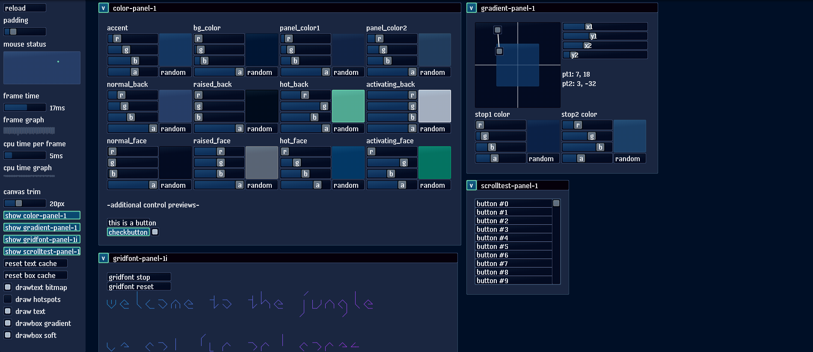

([demo](https://remzmike.github.io/simpleui/))

* simpleui - v00 - 12/8/2016 10:19:01 AM - preview release
* simpleui - v01 - 9/16/2018 1:03 PM - added webgl support

## ABOUT

This is an "immediate-mode ui", which basically means ui components are functions.

This is useful because it changes the way gui applications are written and extended.

It is a work in progress, written in a straight-line style for easy experimentation.

## History.

I wrote this twice in C#, then ported to lua, then ported to this javascript.

Where has this library been used?

    * XNA (C#)
    * Mono GTK [cairo] (C#)
    * leaguebot (lua)
    * love2d (lua)
    * html webgl [pixi] (javascript)
    * html canvas (javascript)

## TODO

* js dependencies (prolly require or something)
* modularization of simpleui_ex_*, and more
* refactor / semantic compression
* nested stack auto id's
* dom renderer (no canvas)