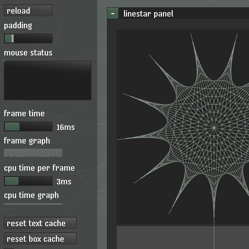

([demo](https://remzmike.github.io/simpleui/))

* simpleui - v00 - 12/8/2016 10:19:01 AM - preview release
* simpleui - v01 - 9/16/2018 1:03 PM - added webgl support
* simpleui - v02 - 11/10/2018 4:14 PM - broad refactoring

## About

This is an "immediate-mode ui", which basically means ui components are functions.

This is useful because it changes the way gui applications are written and extended.

It is a work in progress, written in a straight-line style for easy experimentation.

## History

I wrote this twice in C#, then ported to lua, then ported to this javascript.

Where has this library been used?

    * XNA (C#) (2008)
    * Mono GTK [cairo] (C#) (2012)
    * leaguebot (lua) (2014)
    * love2d (lua) (2015)    
    * html canvas (javascript) (2016)
    * html webgl [pixi] (javascript) (2018)

## Todo

* refactor / semantic compression
* nested stack auto id's
* dom renderer (no canvas)

See also: https://github.com/remzmike/lua-simpleui