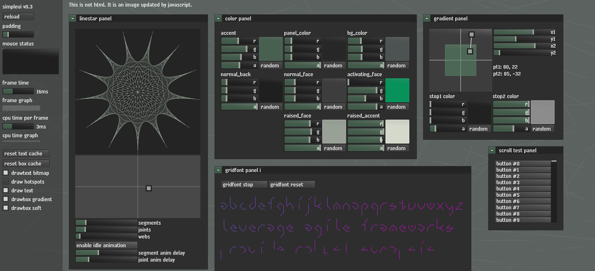

simpleui - v00 - 12/8/2016 10:19:01 AM - preview release

## ABOUT
this is an "immediate-mode ui", which basically means ui components are functions
this is useful because it changes the way gui applications are written and extended
it is a work in progress, written in a straight-line style for easy experimentation
i wrote this in c# first, then ported it to lua, then ported to this javascript

## TODO
js dependencies (prolly require or something)
modularization of simpleui_ex_*, and more
refactor / semantic compression
nested stack auto id's
webgl renderer
dom renderer (no canvas)